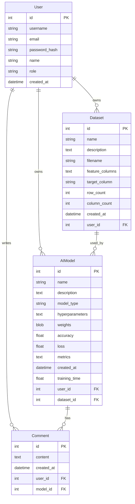
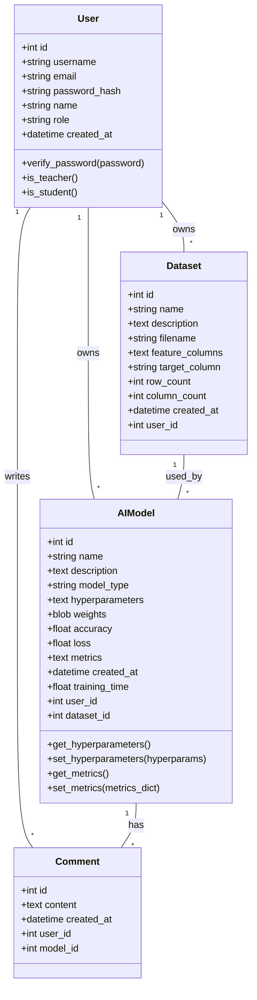
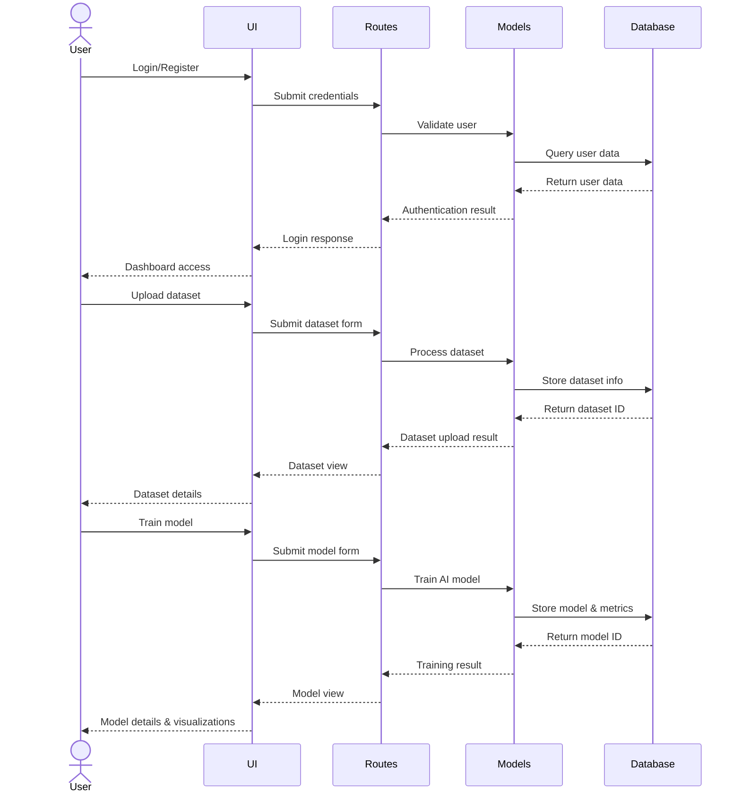
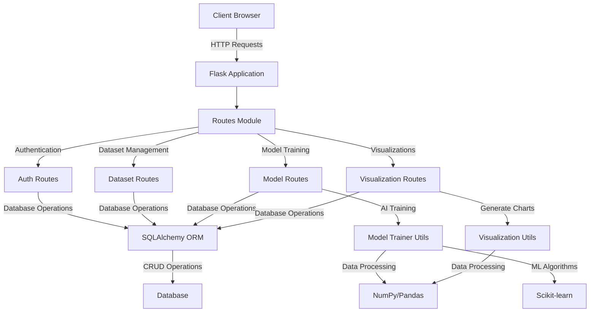

# System for Experiments with Artificial Intelligence - Architecture

## Database Schema (Entity-Relationship Diagram)

## Application Structure (Class Diagram)

## Application Flow (Sequence Diagram)

## Component Diagram

This architecture follows the Model-View-Controller (MVC) pattern:
- **Models**: Database models (User, Dataset, AIModel, Comment)
- **Views**: HTML templates with Bootstrap
- **Controllers**: Route handlers in different blueprints 